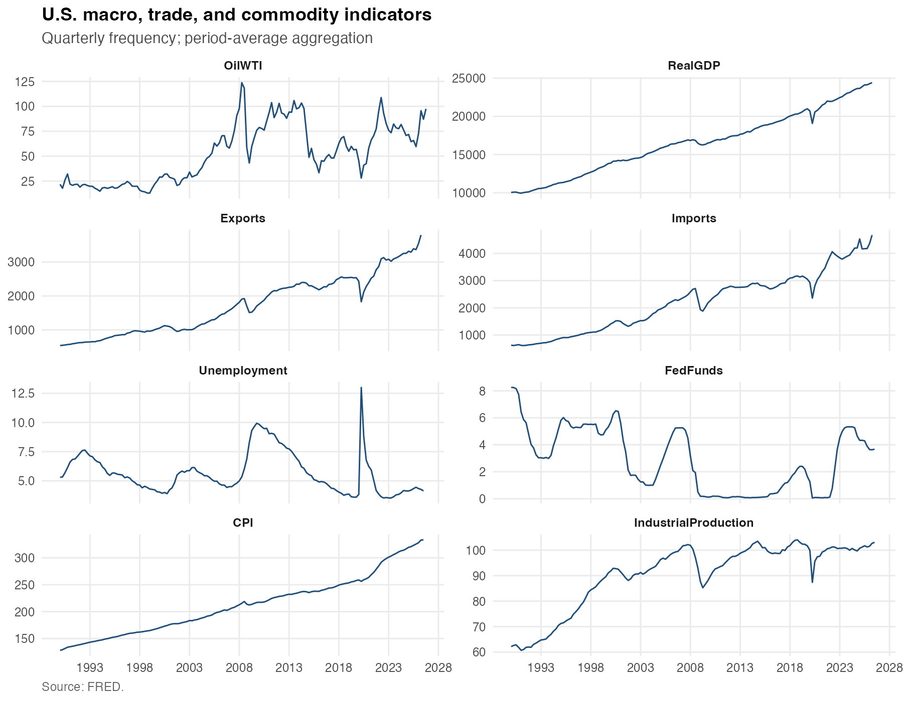
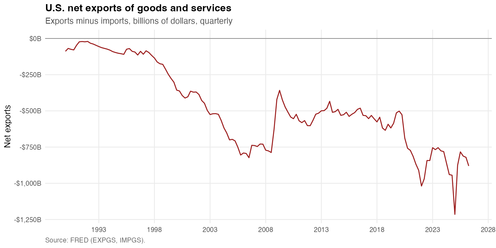
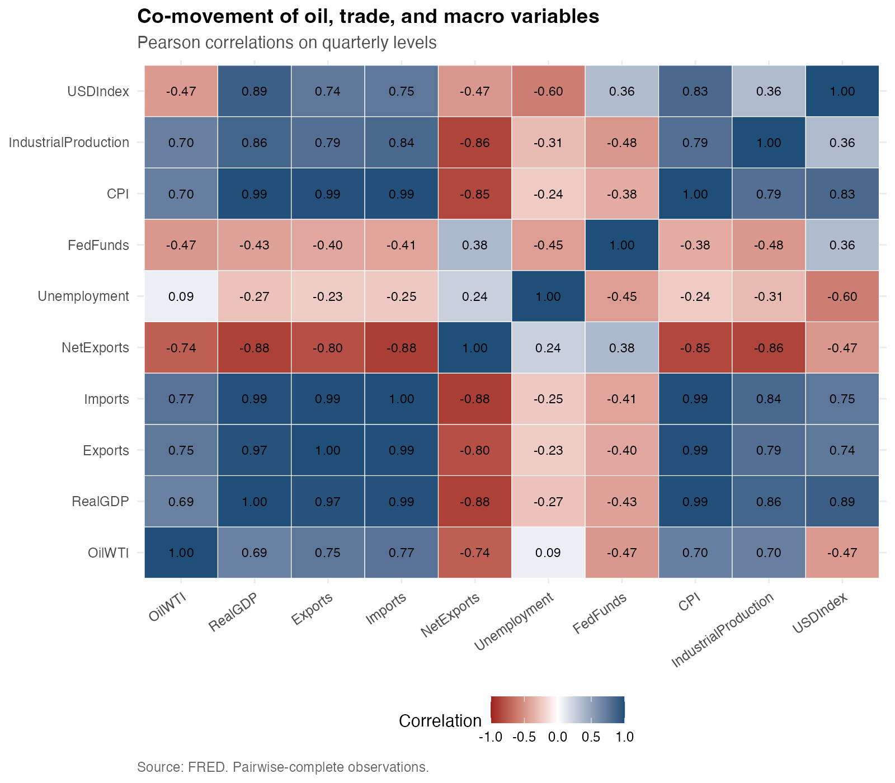
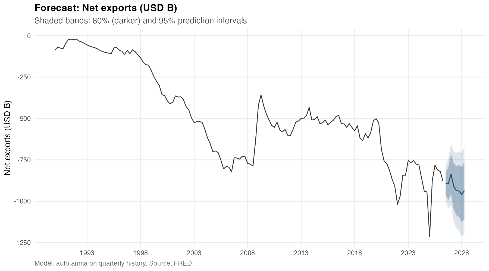
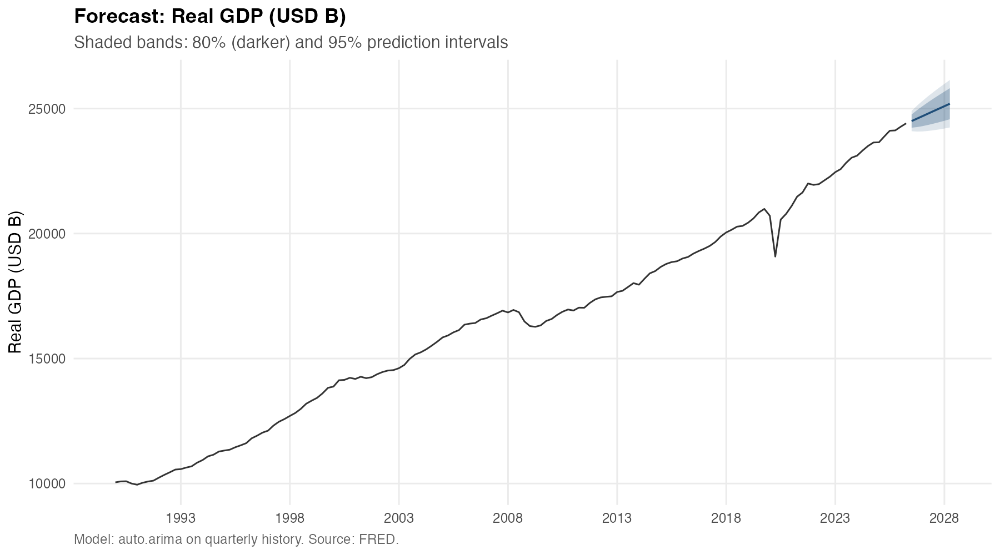
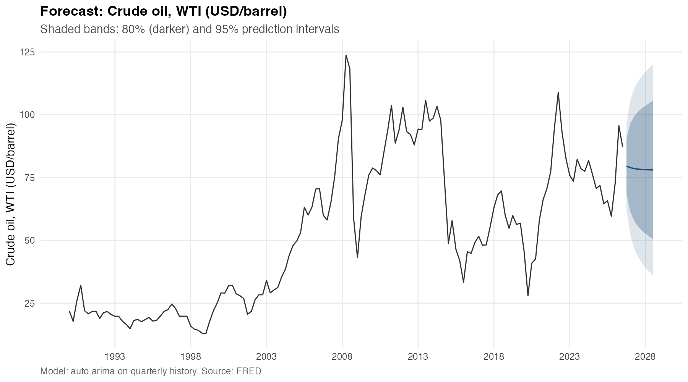
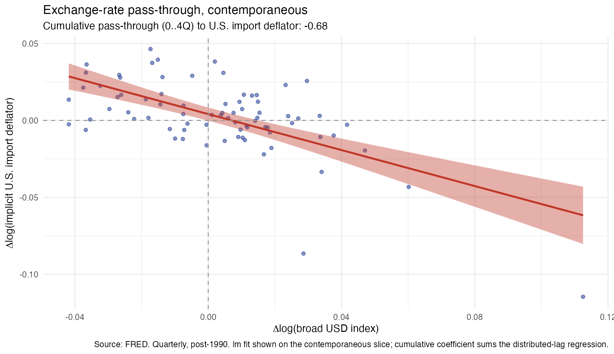

# U.S. Macro Financial Forecast

A reproducible R pipeline that pulls 13 U.S. macro, trade, and commodity series from FRED, harmonizes them into a quarterly panel, computes derived trade measures, produces 8-quarter ARIMA baseline forecasts, and estimates the exchange-rate pass-through to U.S. trade prices.

---

## Overview

This project is a portfolio-style research-support workflow built on public FRED data. It demonstrates:

- **Reproducible data collection** — one command regenerates every artifact.
- **Frequency harmonization** — daily, monthly, and quarterly series aligned to a quarterly panel.
- **Derived trade measures** — net exports, implicit import/export deflators, terms of trade.
- **Baseline forecasting** — `auto.arima` forecasts for net exports, real GDP, and WTI crude oil with 80% and 95% prediction intervals.
- **Empirical analysis** — distributed-lag exchange-rate pass-through regression on U.S. import and export deflators.

Everything is modular: reusable helpers live in `R/`, pipeline stages live in `scripts/`, and every output is written to disk for review.

---

## Data Sources

All data are sourced from the **Federal Reserve Bank of St. Louis (FRED)** via the `fredr` R package. No proprietary or non-public data is used.

| Series ID | Description | Frequency | Used for |
|---|---|---|---|
| GDPC1 | Real Gross Domestic Product | Quarterly | Input + forecast target |
| UNRATE | Civilian Unemployment Rate | Monthly | Descriptive |
| FEDFUNDS | Effective Federal Funds Rate | Monthly | Descriptive |
| CPIAUCSL | Consumer Price Index | Monthly | Input + pass-through control |
| INDPRO | Industrial Production Index | Monthly | Descriptive |
| EXPGS | Exports of Goods and Services (nominal) | Quarterly | Derived (NetExports, ExportDeflator) |
| IMPGS | Imports of Goods and Services (nominal) | Quarterly | Derived (NetExports, ImportDeflator) |
| EXPGSC1 | Real Exports of Goods and Services | Quarterly | Derived (RealNetExports, ExportDeflator) |
| IMPGSC1 | Real Imports of Goods and Services | Quarterly | Derived (RealNetExports, ImportDeflator) |
| DTWEXBGS | Nominal Broad U.S. Dollar Index | Daily | Pass-through regressor |
| DCOILWTICO | Crude Oil Prices: WTI | Daily | Input + forecast target |
| DHHNGSP | Henry Hub Natural Gas Spot Price | Daily | Descriptive |
| PCOPPUSDM | Global Price of Copper | Monthly | Descriptive |

---

## Pipeline Structure

The project follows a modular design:

- **`R/`** — reusable helper functions (I/O, data retrieval, transformation, plotting, modeling, pass-through).
- **`scripts/`** — numbered pipeline stages that orchestrate the workflow.
- **`data/raw/`** — raw FRED snapshots.
- **`data/processed/`** — analysis-ready quarterly panel.
- **`outputs/figures/`** — charts.
- **`outputs/tables/`** — summary tables.

### Stages

| Script | Purpose |
|---|---|
| `01_get_data.R` | Pull 13 FRED series into a long-format snapshot |
| `02_clean_transform_data.R` | Align to quarterly, pivot wide, compute derived measures |
| `03_exploratory_analysis.R` | Descriptive summaries and exploratory figures |
| `04_forecast_model.R` | Fit ARIMA forecasts for NetExports, RealGDP, OilWTI |
| `04b_pass_through.R` | Distributed-lag FX pass-through regression |
| `05_generate_outputs.R` | Run all stages end-to-end |

---

## Methods

### Frequency Alignment
Daily and monthly series are aggregated to a quarterly calendar via **period-average aggregation**. This standardizes the panel at the cost of discarding intra-quarter variation.

### Derived Measures
- **Net exports** = Exports − Imports
- **Implicit export deflator** = (Nominal Exports / Real Exports) × 100
- **Implicit import deflator** = (Nominal Imports / Real Imports) × 100
- **Terms of trade** = Export Deflator / Import Deflator
- **Real net exports** = Real Exports − Real Imports
- YoY (4-quarter) and QoQ (1-quarter) growth rates on all numeric level columns.

### Baseline Forecasting
`forecast::auto.arima` with full grid search (`stepwise = FALSE`, `approximation = FALSE`), 8-quarter horizon, 80% and 95% prediction intervals. ARIMA is deliberately framed as a univariate baseline; richer models (VAR, BVAR) are listed as future improvements.

### Pass-Through Regression
Single-equation OLS of Δlog(deflator) on contemporaneous and lagged Δlog(USD index) with lags 0–4 and a Δlog(CPI) control. The cumulative pass-through coefficient is the sum of the FX terms.

---

## Key Findings

### ARIMA Forecasts
- **Net exports** — `ARIMA(0,1,0)(2,0,0)[4] with drift`. A near-random-walk with a persistent negative drift reflecting the long-run U.S. trade deficit.
- **Real GDP** — `ARIMA(0,1,1) with drift`. An MA(1) on first differences with a positive drift capturing trend growth.
- **WTI crude oil** — `ARIMA(1,1,2)`. Model selection, prediction intervals, and output schema match the macro targets.

### Exchange-Rate Pass-Through
- **Imports** — cumulative pass-through (0–4Q): **−0.685**
- **Exports** — cumulative pass-through (0–4Q): **−0.483**

A 1% appreciation of the broad dollar is associated with a cumulative decline of about 0.69% in the U.S. import deflator and 0.48% in the export deflator over four quarters. The negative sign is consistent with theory: dollar appreciation lowers import prices. Import pass-through exceeds export pass-through, consistent with the U.S. as a large open economy.

---

## Outputs

### Figures















### Tables

- `outputs/tables/descriptive_summary.csv` — per-series n / range / mean / sd
- `outputs/tables/model_summary.csv` — ARIMA coefficients + AIC / BIC / sigma²
- `outputs/tables/forecast_results.csv` — 8-quarter point forecasts and 80% / 95% intervals
- `outputs/tables/passthrough_coefficients.csv` — per-term estimates and cumulative pass-through

---

## Reproducibility

```r
# 1. Install dependencies
install.packages(c(
  "tidyverse", "lubridate", "fredr", "forecast",
  "broom", "here", "scales", "testthat"
))

# 2. Set FRED API key
# Copy .Renviron.example to .Renviron and add your key
# FRED_API_KEY=your_key_here

# 3. Run the entire pipeline
source(here::here("scripts", "05_generate_outputs.R"))
